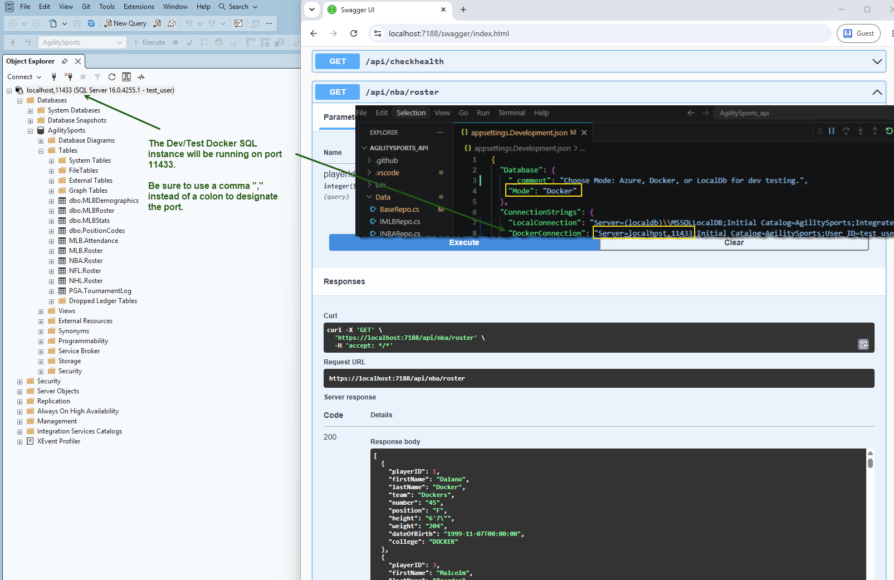

# This repo is from the Full-Stack hands-on lab presented at the PhillyDotNet users group by Bill Wolff

## The assignment is to create an Angular sports website with a DotNet Minimal API layer and a SQL Server backend database

---

A replay of the hands-on demonstration can be found on YouTube [here](https://github.com/phillydotnet/Presentations/tree/main/2023/0816-dotnet).

My copy of the code has evolved since that original training and is maintained on GitHub:

- Angular Web frontend repo (TypeScript) is [here](https://github.com/smagara/AgilitySports_web).
- DotNet Minimal API repo (C#) is [here](https://github.com/smagara/AgilitySports_api).
- SQL Server Database code is [here](https://github.com/smagara/AgilitySports_data).

See the GitHub project tracking for the various training issues and initiatives [here](https://github.com/users/smagara/projects/3/views/1).  As an exercise in GitHub Project management functionality with KanBan.

CI/CD pipelines are set up to deploy the code to the Azure cloud.

Note for Devs:  
- A SQL Server installation is no longer a prerequisite!

- The default Dev configuration now by default uses a Docker container SQL 2022 image running on port 11443.

- Running F5 Debug should now launch a web browser pointed at the Swagger UI endpoint that expects this database to be online.

- Prior to launching the API, be sure to start the MSSQL Docker container with the Powershell script documented in the AgilitySports_Data repo README. This will spin up a SQL instance on port `11433` with some test data to get you started. Align the API's `DockerConnection` here in `appsettings.Development.json` to those settings. See the screenshot below for guidance.

- Or, of course, customize this stack to your needs.

  
📁 Sample DB Config screenshot:

