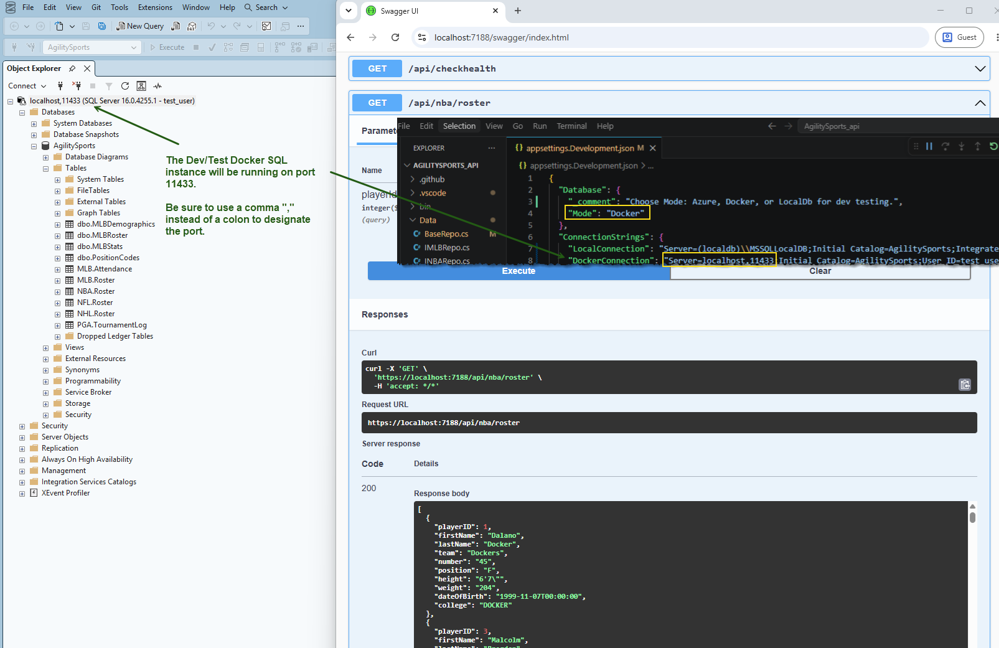

# This repo is from the Full-Stack hands-on lab presented at the PhillyDotNet users group by Bill Wolff

## The assignment is to create an Angular sports website with a DotNet Minimal API layer and a SQL Server backend database

---

### Now as of July 2026 a Docker container is available for this API Repo, instructions below!

### All AgilitySports repos are aligned to the new, normalized, version 2 of the AgilitySports database model. This paves the way for additional lookup functionality and planned AI tool support.

---

A replay of the hands-on demonstration can be found on YouTube [here](https://github.com/phillydotnet/Presentations/tree/main/2023/0816-dotnet).

My copy of the code has evolved since that original training and is maintained on GitHub:

- Angular Web frontend repo (TypeScript) is [here](https://github.com/smagara/AgilitySports_web).
- DotNet Minimal API repo (C#) is [here](https://github.com/smagara/AgilitySports_api).
- SQL Server Database code is [here](https://github.com/smagara/AgilitySports_data).

See the GitHub project tracking for the various training issues and initiatives [here](https://github.com/users/smagara/projects/3/views/1).  As an exercise in GitHub Project management functionality with KanBan.

CI/CD pipelines are set up to deploy the code to the Azure cloud.

Note for Devs: <br/>
- A SQL Server installation is no longer a prerequisite!

- The default Dev configuration now by default uses a Docker container SQL 2022 image running on port 11443.

- Running F5 Debug should now launch a web browser pointed at the Swagger UI endpoint that expects this database to be online.

- Prior to launching the API, be sure to start the MSSQL Docker container with the Powershell script documented in the AgilitySports_Data repo README. This will spin up the new V2 SQL instance on port `21433` (or the deprecated V1 database model on port `11433`) with some test data to get you started. Align the API's `DockerConnection` here in `appsettings.Development.json` to those settings. See the screenshot below for guidance.

- Or, of course, customize this stack to your needs.

<details>
  <summary>📁 Sample DB Config screenshot:</summary>


</details>

---

## Run the API in Docker

Prerequisite: [Docker Desktop](https://www.docker.com/products/docker-desktop/). For `Database:Mode=Docker`, also start the V2 SQL stack from the AgilitySports_Data repo (`.\BuildDockerImage_V2.ps1`) so SQL is listening on port `21433`.

From the API repo root:

```powershell
.\BuildDockerImage.ps1
```

Optional switches:

- `-ForegroundLogs` - stream container logs after start
- `-NoBuild` - start without rebuilding the image
- `-Recreate` - stop and remove the existing compose stack before starting

On first run the script copies `Container\.env.example` to `Container\.env` if needed. Edit `.env` to change the published port or SQL connection string.

After start:

- API: `http://localhost:1106`
- Swagger UI: `http://localhost:1106/swagger`
- Health: `http://localhost:1106/api/v2/checkhealth`
- DB health: `http://localhost:1106/api/v2/health/db`

The container reaches the host-published SQL V2 instance via `host.docker.internal,21433` (aligned with AgilitySports_Data defaults). View logs later with:

```powershell
docker compose -f .\Container\docker-compose.yml logs -f api
```

---

Dev Note (July 2026):

- Request-level XSS middleware logging is now configurable and disabled by default to reduce noise.
- Toggle with `XssLogging:EnableRequestLogging` in `appsettings.json` or `appsettings.Development.json`.
- Default value is `false`.

---

## API Specifications

- Overall API specification (purpose, architecture, setup, endpoint catalog, request/response conventions, usage workflow): [Docs/AgilitySports_API_Overall_Specification.docx](Docs/AgilitySports_API_Overall_Specification.docx)
- Player/stats contract specification (cross-sport stat field mapping and persistence behavior): [Docs/AgilitySports_API_PlayerStats_Spec.docx](Docs/AgilitySports_API_PlayerStats_Spec.docx)